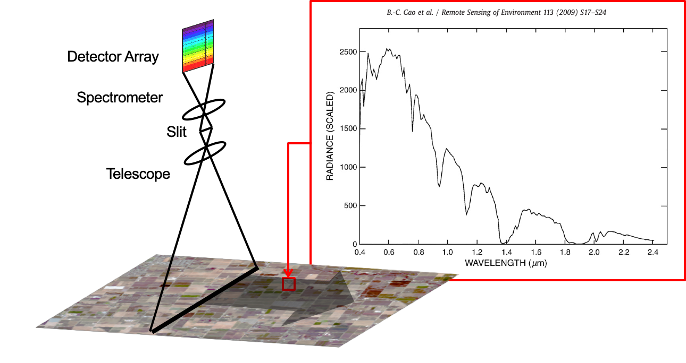

# istutor: Imaging spectroscopy tutorial materials

Dr. David R. Thompson  
Imaging Spectroscopy Group  
NASA Jet Propulsion Laboratory (JPL)  

## Overview

This is a sequence of hands-on lab experiences using open-source software for imaging spectrometer data analysis. The exercises are designed to introduce basic concepts behind imaging spectroscopy and provide practical experience in visualization, atmospheric correction, and surface property estimation with rigorous uncertainty propagation.  

The course exercises are self-contained in Jupyter Notebook files, with additional details available in associated PowerPoint presentations. The exercises also rely on the open-source Python [ISOFIT library](https://github.com/isofit/isofit) for atmospheric correction. We suggest the OpenSpectra project for visualization capability similar to the ENVI graphical user interface.  

&nbsp;

## Installation

After, install the required dependencies from:  

- A clone of the ISOFIT repository: <https://github.com/isofit/isofit>
- A clone of the OpenSpectra project: <https://github.com/openspectra/openspectra>

An easy cross-platform way to get all the necessary Python dependencies (and Juypter Notebook) is to download and install the Anaconda distribution, freely available here: <https://www.anaconda.com/distribution/>.  

Finally, there are a few large binary files that you will need for certain exercises, and are not stored in the repository due to their size. These are currently posted at <ftp://popo.jpl.nasa.gov/pub/DThompson/istutor/>. This location is subject to change. Download all of the files at this FTP site and store them in a base level folder in the `istutor` repository named `ftp`.

## Citation

If you use ISOFIT in your research or production, we ask that you cite the precursor publication:

> Thompson, David R., Vijay Natraj, Robert O. Green, Mark C. Helmlinger, Bo-Cai Gao, and Michael L. Eastwood (2018) Optimal estimation for imaging spectrometer atmospheric correction", *Remote Sensing of Environment*, 216, pp. 355-373.

## Notes

Editing provided by Dr. Adam Erickson, Biospheric Sciences Laboratory, NASA Goddard Space Flight Center (GSFC).  
